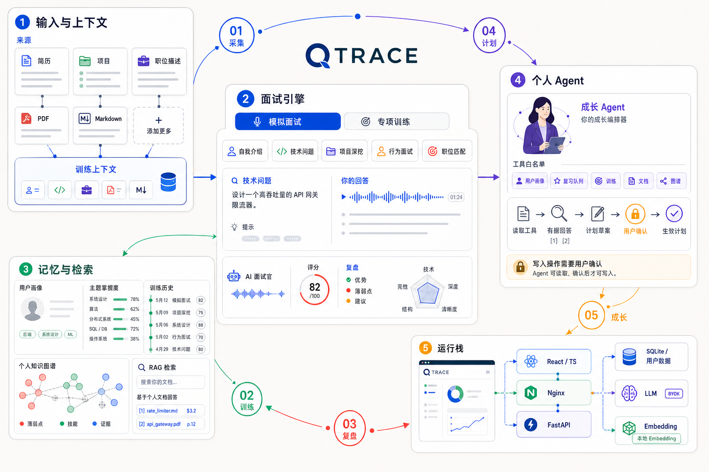

# 问迹 QTrace

  

<h1 align="center">把每一次回答，沉淀成下一次成长</h1>

  面向技术求职者的个性化 AI 技术面试训练与成长工作台

  <a href="http://qtrace.vip">在线 Demo</a>
  ·
  <a href="https://github.com/cartonmouse/QTrace">GitHub</a>
  ·
  <a href="docs/RELEASE_CHECKLIST.md">发布检查清单</a>
  ·
  <a href="THIRD_PARTY_NOTICES.md">第三方说明</a>

> QTrace 将模拟面试、个人资料库、岗位匹配、长期画像、间隔复习和成长 Agent 组合成一个持续运行的训练系统。

  

> **公开 Demo**：QTrace 不提供共享 API Key。用户可以使用 Stub 模式体验基础流程，也可以在自己的账号中填写 OpenAI-compatible LLM/Embedding 配置。请勿在网页截图、Issue、日志或仓库中提交真实 API Key。

## QTrace 是什么

传统的 AI 面试工具通常在一次对话结束后就停止了。QTrace 关注的是更完整的训练闭环：

- 用户提供简历、项目资料和目标岗位；
- 系统根据上下文生成问题、追问和结构化复盘；
- 复盘结果更新个人画像、主题掌握度和 SM-2 复习队列；
- 成长 Agent 读取这些长期信号，生成下一步学习计划；
- 用户确认计划后，计划项回到专项训练中继续执行。

QTrace 的产品价值不是“多一个聊天窗口”，而是让训练结果能够持续影响下一轮训练。

## 产品闭环

~~~mermaid
flowchart LR
    A[简历 / 项目资料 / JD] --> B[训练上下文]
    B --> C[模拟面试 / 专项训练]
    C --> D[结构化复盘]
    D --> E[个人画像 + 主题掌握度]
    D --> F[SM-2 到期复习]
    E --> G[成长 Agent]
    F --> G
    A --> H[分块 + Embedding + 引用检索]
    H --> G
    G --> I[学习计划草稿]
    I --> J{用户确认}
    J --> K[计划驱动专项训练]
    K --> C
~~~

## 产品能力

| 模块 | 能力 |
| --- | --- |
| 模拟面试 | 自我介绍、技术问题、项目深挖、行为问题和反问阶段 |
| 专项训练 | 主题题库、领域画像、计划焦点和到期复习项共同影响训练内容 |
| JD 定向 | 解析岗位描述，将岗位技能与结构化项目字段进行可解释匹配 |
| 个人资料库 | 导入文本、Markdown 和文本层 PDF，支持版本、分块、检索和引用 |
| 结构化简历 | 编辑个人概述、技能和项目证据，生成稳定的训练上下文 |
| 项目追问卡 | 按背景、职责、设计、验证和取舍组织项目深挖问题 |
| 个人记忆 | 保存训练历史、复盘薄弱点、主题掌握度和长期行为信号 |
| 间隔复习 | 使用 SM-2 安排薄弱点的下一次复习时间 |
| 成长 Agent | 读取用户上下文，生成可确认、可追踪的个性化学习计划 |
| 知识图谱 | 从题库、画像和复习项构建用户隔离的可解释关系图 |
| BYOK 模型 | 用户使用自己的 OpenAI-compatible LLM 和 Embedding 服务 |
| 本地语义 | 支持离线确定性向量和本地 Sentence-Transformers 模型 |
| 在线 Demo | Docker Compose、Nginx、FastAPI、健康检查和域名访问 |

## Agent 设计

QTrace 的成长 Agent 不是一个可以自由修改系统的聊天机器人，而是一个受约束的上下文编排器。

1. **规划**：判断当前请求需要哪些用户上下文；
2. **读取**：通过后端白名单工具读取画像、复习、近期训练、简历、图谱和个人资料；
3. **回答**：基于工具结果生成有来源的回复；
4. **行动**：学习计划先保存为 draft，用户确认后才变为 active；
5. **回流**：确认后的计划项可以直接进入专项训练。

写操作和用户确认分离，避免模型的一次输出直接修改长期学习状态。

## 技术架构

~~~mermaid
flowchart TB
    Browser[Browser]
    Web[React + TypeScript + Vite]
    Proxy[Nginx / Vite Proxy]
    API[FastAPI]
    Domain[InterviewEngine / Agent / Documents / Graph / Profile]
    Store[Store + SQLite + User Data Directory]
    Provider[LLM Provider]
    Embed[Embedding Provider]
    LLM[User-configured LLM]
    Browser --> Web
    Web --> Proxy
    Proxy --> API
    API --> Domain
    Domain --> Store
    Domain --> Provider
    Domain --> Embed
    Provider --> LLM
~~~

QTrace 采用模块化单体架构：

| 层 | 主要位置 | 责任 |
| --- | --- | --- |
| Web | frontend/src/App.tsx | 路由、登录保护、ProviderGate 和错误边界 |
| API Client | frontend/src/api/ | Bearer token、请求封装、数据归一化和 SSE 事件解析 |
| HTTP API | backend/main.py | 路由、鉴权、参数校验和领域服务编排 |
| Interview | backend/interview.py | 面试阶段状态机、轮次、回答和复盘 |
| Model | backend/provider.py、backend/embedding.py | LLM/Embedding 适配、重试和响应校验 |
| Documents | backend/personal_documents.py | 文档版本、分块、相似度检索和 citation |
| Agent | backend/agent.py | 工具白名单、上下文、计划草稿和失败契约 |
| Learning | backend/store.py、backend/review_schedule.py | 画像、主题掌握度、SM-2 和计划状态 |
| Deploy | deploy/、docker-compose.demo.yml | 生产构建、API 反代、健康检查和数据卷 |

LLM 负责生成问题、追问、复盘和自然语言回答；业务代码负责认证、用户隔离、训练状态机、工具权限、复习日期和数据一致性。

## 模型与检索

### LLM Provider

QTrace 通过 Provider 抽象支持不同模型来源：

| 模式 | 作用 |
| --- | --- |
| Stub Provider | 确定性、零网络、无费用，适合首次体验和自动化测试 |
| OpenAI-compatible LLM | 生成开场问题、追问、结构化复盘和 Agent 回答 |

模型输出在写入业务状态前会经过响应结构、空内容、JSON 字段和状态校验。模型供应商可以替换，面试状态机不需要随之重写。

### Embedding Provider

| 模式 | 作用 |
| --- | --- |
| Deterministic Embedding | 离线生成稳定基线向量，作为默认降级能力 |
| Local Sentence-Transformers | 从本地模型目录加载，使用 local-files-only，避免运行时联网下载 |
| OpenAI-compatible Embedding | 调用 embeddings 接口并校验响应结构和向量维度 |

Embedding 负责“找到相关证据”，LLM 负责“组织回答”。个人文档不会默认整份拼接到 Prompt，而是经过规范化、内容指纹、分块、向量化和用户范围内检索。

### 文档处理

~~~text
文本 / Markdown / 文本层 PDF
    ↓
规范化与 SHA-256 内容身份
    ↓
按段落和句子边界分块
    ↓
生成 Embedding 并保存文档版本
    ↓
相似度检索 + token/CJK bigram 补分
    ↓
返回版本化 citation
~~~

切换 Embedding 模型后，旧向量不会被静默混用；用户需要显式重建索引。扫描图片型 PDF 当前不等同于 OCR。

## 快速开始

### 本地开发

需要 Python、Node.js/npm。后端和前端分别在两个终端启动。

终端一：后端

~~~powershell
git clone https://github.com/cartonmouse/QTrace.git
cd QTrace

python -m venv .venv
# Windows PowerShell
.\.venv\Scripts\Activate.ps1
# macOS/Linux 可使用：source .venv/bin/activate

python -m pip install -r requirements.txt
python -m uvicorn backend.main:app --host 127.0.0.1 --port 8002
~~~

终端二：前端

~~~powershell
cd QTrace\frontend
npm ci
npm run dev
~~~

浏览器访问：<http://127.0.0.1:5174>

注册账号后，可以在模型设置中选择 Stub 模式离线体验；需要真实模型时，再填写自己的 API Base、Model 和 API Key。

### Docker Demo

~~~powershell
Copy-Item deploy\demo.env.example deploy\demo.env
# 编辑 deploy/demo.env，至少设置一个随机的 REBUILD_JWT_SECRET
docker compose --env-file deploy\demo.env -f docker-compose.demo.yml up -d --build
~~~

启动后访问：<http://127.0.0.1:8080>

停止服务：

~~~powershell
docker compose --env-file deploy\demo.env -f docker-compose.demo.yml down
~~~

Docker 链路为：

~~~text
Nginx Web → FastAPI API → SQLite 命名数据卷
~~~

公开 Demo 默认使用 session 级 BYOK 存储，并开启私有 API Base 拦截。正式公网运行仍需要 HTTPS、限流、预算、日志脱敏和更严格的网络出口策略。

## 模型设置

登录后进入模型设置：

- **LLM**：填写 OpenAI-compatible chat completions 服务地址、模型名和 API Key；
- **Embedding**：选择确定性、本地语义或外部 Embedding；
- **本地模型**：填写后端可访问的 Sentence-Transformers 模型目录；
- **连接测试**：只发送最小合成请求，不会上传真实简历；
- **保存与重建**：模型切换后，个人文档需要显式重建索引。

设置查询接口只返回已配置状态，不返回原始 Key。公共 Demo 建议使用临时、低额度 Key，并在使用后及时撤销。

## 验证

测试使用合成账号、合成文档和 Fake/Stub Provider，不调用真实模型，也不读取真实简历。

~~~powershell
# 根目录
python -m pytest -q
python -m compileall -q backend tests

# 前端
Set-Location frontend
npm run typecheck
npm run build
Set-Location ..

# 只读发布/路由预检
python scripts\repository_preflight.py
python scripts\public_demo_preflight.py
python scripts\qtrace_shell_preflight.py
python scripts\qtrace_interview_preflight.py
python scripts\qtrace_profile_preflight.py
python scripts\qtrace_settings_preflight.py
~~~

健康检查：

~~~text
GET /api/health
→ {"status":"ok","mode":"qtrace"}
~~~

## 项目结构

~~~text
backend/
  main.py                 FastAPI 路由、认证依赖和服务组装
  interview.py            面试阶段状态机
  provider.py             Stub/真实 LLM Provider
  embedding.py            Embedding Provider
  personal_documents.py   文档分块、向量检索和 citation
  agent.py                成长 Agent 工具和学习计划
  graph.py                知识图谱 read model
  review_schedule.py      SM-2 复习调度
  store.py                SQLite、用户隔离和持久化

frontend/src/
  App.tsx                 路由、ProtectedRoute、ProviderGate
  api/                    后端 API 适配
  contexts/               认证和全局状态
  components/             QTrace 工作台壳层
  pages/                  训练、画像、Agent、资料库和设置页面

deploy/
  Dockerfile.backend      FastAPI 镜像
  Dockerfile.web          Vite 构建 + Nginx 镜像
  nginx.conf              SPA fallback、/api 反代和静态资源
  demo.env.example        Demo 环境变量模板

docs/
  RELEASE_CHECKLIST.md    发布前检查和验收边界
  STAGE*.md               分模块设计与验证记录
~~~

## 安全与数据边界

- 真实 API Key、真实简历、真实录音和 SQLite 数据不进入仓库；
- .env、data/、SQLite、前端依赖和构建产物已加入忽略规则；
- 会话、个人文档、Embedding chunk、Agent 对话和计划均按 user_id 隔离；
- API Key 不从设置查询接口返回；公开 Compose 默认不持久化访问者 Key；
- API Base 会进行格式、私网地址和回环地址校验；
- 公开 Demo 属于演示环境，不承诺生产级多租户、密钥托管、并发和成本治理。

## 产品路线

### 已具备

- 模拟面试和专项训练闭环；
- 用户画像、主题掌握度和 SM-2 复习；
- PDF/Markdown 个人资料库和版本化检索引用；
- 结构化简历、项目追问卡和 JD→项目映射；
- 知识图谱最小读模型；
- 受控 Personal Agent 和确认式学习计划；
- 本地运行与 Docker Demo 交付形态。

### 规划中

- 扫描 PDF OCR；
- 真实长音频、ASR、说话人识别和时间戳对齐；
- 更完整的实时 Copilot 与 WebSocket 事件流；
- 外部向量数据库和大规模检索；
- 公网环境的密钥托管、限流、预算和审计；
- 面向训练效果的离线评测与长期指标。

## 文档与贡献

- [发布检查清单](docs/RELEASE_CHECKLIST.md)：部署前配置、健康检查和验收边界；
- [上下文说明](CONTEXT.md)：领域词汇、数据边界和设计决策；
- [模块文档](docs/)：各功能模块的实现说明、验证结果和已知限制；
- [第三方说明](THIRD_PARTY_NOTICES.md)：参考项目和第三方代码归属。

欢迎通过 Issue 反馈问题，或提交聚焦功能、测试和文档的 Pull Request。涉及 API Key、真实个人资料和部署凭据的内容请勿提交到仓库。
