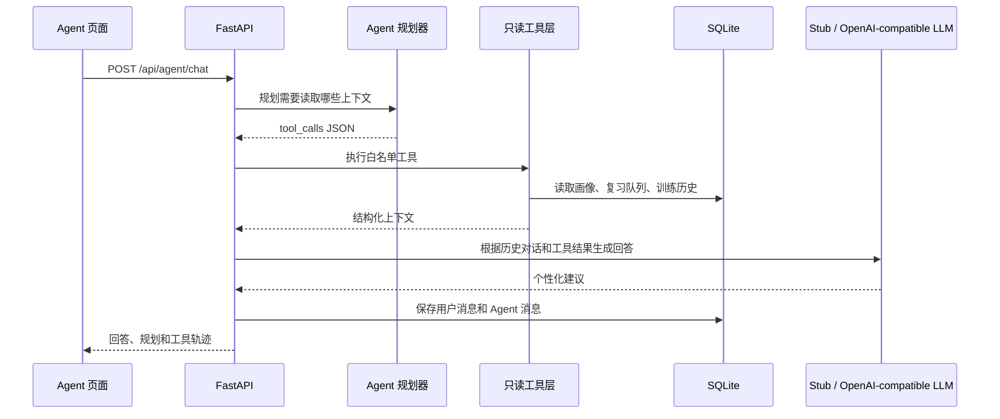

# 阶段 12：Personal Agent v1

## 目标

为了匹配 AI Agent 岗位的学习目标，本阶段不再把 Personal Agent 作为可选页面，而是实现一个可以解释、测试和继续扩展的文本 Agent。

第一版刻意不接实时语音、不使用 WebSocket，也不允许 Agent 直接修改用户数据。先固定最重要的 Agent 主链：



## Agent 和普通 LLM 调用的区别

普通 LLM 调用是：

```text
用户问题 -> prompt -> LLM -> 文本回答
```

本阶段的 Agent 是一个受控的两步工作流：

```text
用户问题
  -> 规划器决定读取哪些工具
  -> 后端执行工具并返回结构化结果
  -> LLM 结合工具结果回答
  -> 保存对话记忆
```

模型不能直接执行任意 Python 函数。规划结果会经过白名单校验，只有允许的工具名才会被执行。

## 当前工具

| 工具 | 作用 | 是否修改数据 |
| --- | --- | --- |
| `read_profile` | 读取全局画像、领域掌握度和长期薄弱点 | 否 |
| `read_due_reviews` | 读取今日到期的 SM-2 复习任务 | 否 |
| `read_recent_sessions` | 读取近期训练模式、岗位、分数和复盘信号 | 否 |
| `read_resume` | 读取已经上传的简历文本 | 否 |

所有工具都带有当前用户的 `user_id`。Agent 对话也保存为用户级数据，其他用户不能通过对话 ID 访问。

## 代码结构

| 文件 | 职责 |
| --- | --- |
| `backend/agent.py` | Agent 模型边界、规划解析、工具执行、上下文组装和回答生成 |
| `backend/store.py` | `agent_conversations` 表和对话持久化 |
| `backend/main.py` | 鉴权、模型选择、Agent API 编排 |
| `backend/models.py` | Agent 请求、对话和工具轨迹响应模型 |
| `frontend/src/App.tsx` | Agent 页面、对话历史和工具轨迹展示 |
| `frontend/src/api.ts` | Agent API client 和 TypeScript 类型 |
| `tests/test_agent.py` | Stub、用户隔离和真实 Provider 契约测试 |

## 两种模型模式

### 本地 Stub 模式

Stub 模式不会访问网络。它使用确定性规划和回答，用于验证：

- 工具白名单是否生效；
- 画像、复习队列和历史是否能被读取；
- 对话是否正确持久化；
- 用户数据是否隔离；
- 前端能否展示 Agent 轨迹。

### OpenAI-compatible 模式

真实模型模式会调用两次 Chat Completions：

1. 规划调用：只返回 `intent` 和 `tool_calls` JSON；
2. 回答调用：接收用户问题、近期对话和工具结果，生成最终建议。

API Base、Model 和 API Key 仍然通过本地模型设置页面配置，后端不会把 API Key 返回给前端。真实 Key 不写入测试代码，也不放入 Git 仓库。

## 为什么第一版工具只读

如果 Agent 直接拥有“修改画像、创建训练、删除资料”等工具，用户很难区分模型建议和已经执行的动作。当前先让 Agent 证明自己能读取长期上下文并给出个性化建议。

后续增加写工具时，需要：

1. 设计结构化参数和权限边界；
2. 后端再次校验参数；
3. 对有副作用的动作要求用户确认；
4. 保存工具调用结果和失败状态。

## 与 TechSpar 的关系

本阶段对应参考项目中的 Personal Agent 基础能力：画像、到期复习、训练历史和简历被统一带入 Agent 上下文。但当前还没有实现：

- 文档向量检索和 RAG；
- 多 Agent Copilot Prep；
- LLM 自动写回强项、行为信号和长期模式；
- Agent 自动创建专项训练任务；
- WebSocket 实时辅助。

因此当前应表述为“文本 Personal Agent v1”，不能表述为已经完成 TechSpar 的完整多 Agent 和实时 Copilot。

## 验证结果

- 后端测试：`18 passed`；
- Python `compileall`：通过；
- 前端 TypeScript 类型检查：通过；
- 前端生产构建：通过；
- 本地联调：`POST /api/agent/chat` 成功返回规划、工具轨迹和回答；对话历史查询成功；
- 没有使用真实简历、真实录音或真实 API Key。

## 面试追问准备

### Q：你的 Agent 和普通聊天接口有什么区别？

普通聊天接口直接把用户问题交给模型。本项目的 Agent 先让模型输出受约束的工具规划，再由后端执行白名单工具，最后把工具结果交给模型生成回答，因此模型可以利用用户画像和复习状态，但不能直接访问数据库。

### Q：为什么不让模型直接调用数据库？

数据库访问属于基础设施权限，不应该暴露给模型。工具层把数据库操作封装成最小能力，并且每个查询都绑定当前用户 ID，便于做鉴权、审计和测试。

### Q：如果模型返回不存在的工具怎么办？

后端只接受预先定义的工具名，未知工具会被过滤或拒绝；工具执行失败会记录为失败轨迹，不伪装成成功结果。

### Q：这个 Agent 会不会自动安排学习任务？

当前不会直接修改数据，只会根据画像和 SM-2 队列给出建议。后续可以增加 `create_training_plan` 等写工具，但需要参数校验和用户确认。

## 下一步

1. 在不破坏 Stub 测试的前提下，用用户自己的 OpenAI-compatible API 做一次真实规划/回答联调；
2. 将专项训练升级为 LLM 根据掌握度、趋势和到期复习项动态出题；
3. 扩充画像字段，增加强项、行为信号和跨领域模式；
4. 再评估是否需要多 Agent Copilot，不立即引入实时音频和 WebSocket。
