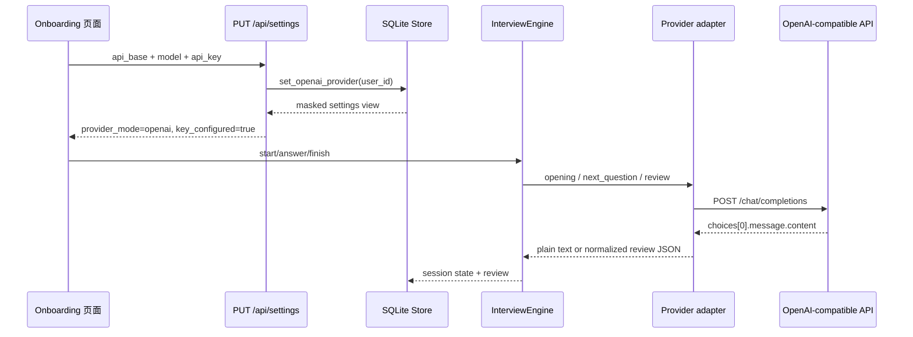

# Stage 2：Provider 适配层与真实 LLM 配置

## 目标

第一阶段的 `StubProvider` 只负责让流程可运行。第二阶段把模型能力抽象成 `InterviewProvider` 协议，并新增 `OpenAICompatibleProvider`，让状态机不需要知道实际使用的是本地 stub 还是远程 Chat Completions 服务。

## 调用链



## 文件责任

| 文件 | 责任 |
| --- | --- |
| `backend/provider.py` | Provider 协议、stub、HTTP 调用、结构化复盘解析 |
| `backend/interview.py` | 不依赖供应商的状态机；只调用协议方法 |
| `backend/store.py` | 用户级 provider 配置、旧数据库字段迁移、key 不回传 |
| `backend/main.py` | 根据 user_id 配置选择 provider，并把 provider 错误映射为 HTTP 502 |
| `frontend/src/App.tsx` | 首次配置页的本地演示/真实 LLM 两种入口 |
| `frontend/src/api.ts` | Settings 类型和统一 HTTP 调用 |

## 为什么状态机不直接调用 HTTP

如果 `InterviewEngine` 直接创建 `httpx.Client`，它会同时承担流程控制、prompt 构造、网络错误、JSON 解析和供应商差异，后续很难测试。现在状态机只知道：

```python
opening(...)
next_question(...)
review(...)
```

这三个方法组成了最小模型能力边界。`StubProvider` 和 `OpenAICompatibleProvider` 可以替换，状态机测试不需要网络。

## OpenAI-compatible 请求约定

发送到：

```text
{API_BASE}/chat/completions
```

请求包含：

- `Authorization: Bearer <API_KEY>`
- `model`
- `messages: [{role: system, content}, {role: user, content}]`
- `temperature`

读取：

```text
choices[0].message.content
```

真实 API 返回的内容仍然是不可信输入：普通问题需要非空字符串，复盘需要 JSON。代码中分别做了状态码、字段存在性、空内容和 JSON 格式校验。

## 当前安全与功能边界

- API Key 只在本地设置接口中写入 SQLite，设置响应只返回 `llm_key_configured`，不返回原文。
- 当前没有填写真实 key，也没有向外部模型发起请求；OpenAI 兼容适配器只用 `httpx.MockTransport` 做了合成测试。
- Embedding 仍标记为本地 demo 占位，尚未实现真正向量化和检索。
- 后续接真实 key 前，需要把本地数据库和 `.env` 排除在 GitHub 提交之外，并进一步讨论本地 key 加密/权限边界。

## 面试追问卡

### Q1：为什么要按用户动态创建 Provider？

因为不同用户可以配置不同的 API Base、模型和 key；把 Provider 做成全局单例会造成配置串用和并发下的用户隔离风险。

### Q2：为什么 API Key 可以存储但不能返回？

设置接口需要保存它以便后续调用，但读取设置只需要知道“是否已配置”。返回原 key 会扩大浏览器、日志和前端状态泄露范围。

### Q3：为什么模型错误返回 502 而不是伪造复盘？

502 表示上游模型依赖失败，前端可以提示重试；伪造一份“解析失败”的正常报告会把错误状态写成成功结果，破坏历史和画像数据。

### Q4：测试没有真实 API Key，如何证明适配器正确？

使用 `httpx.MockTransport` 模拟 OpenAI-compatible 响应，验证 URL、model、消息结构、JSON 解析和 key 不回传；真实服务连通性属于后续单独验收。

